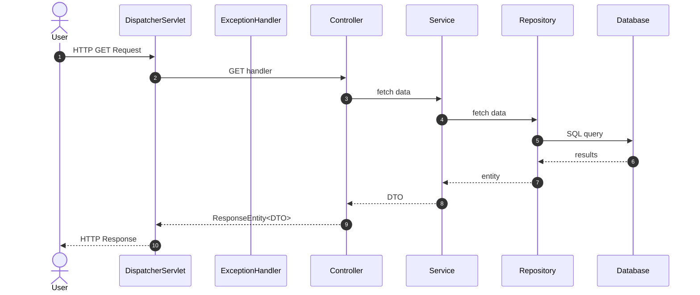
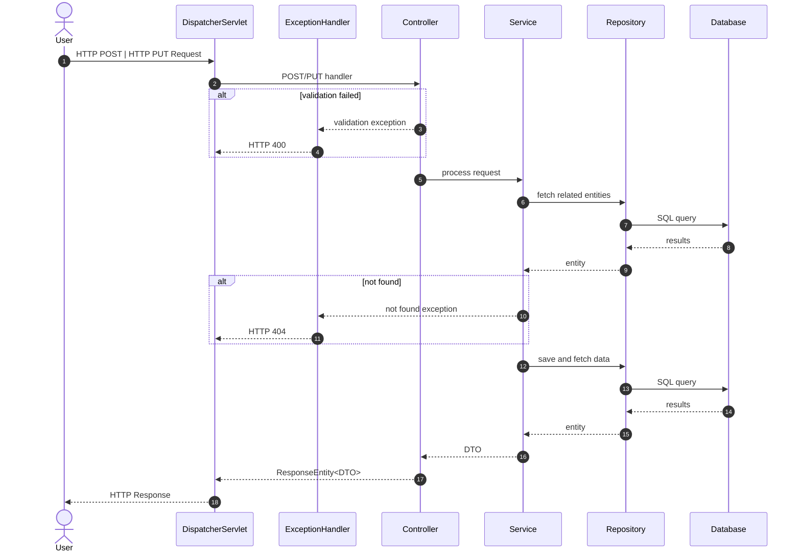
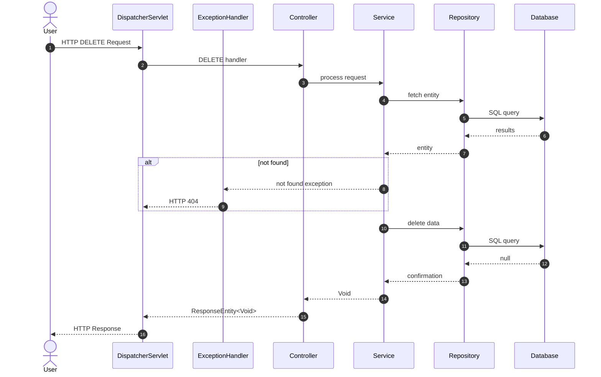
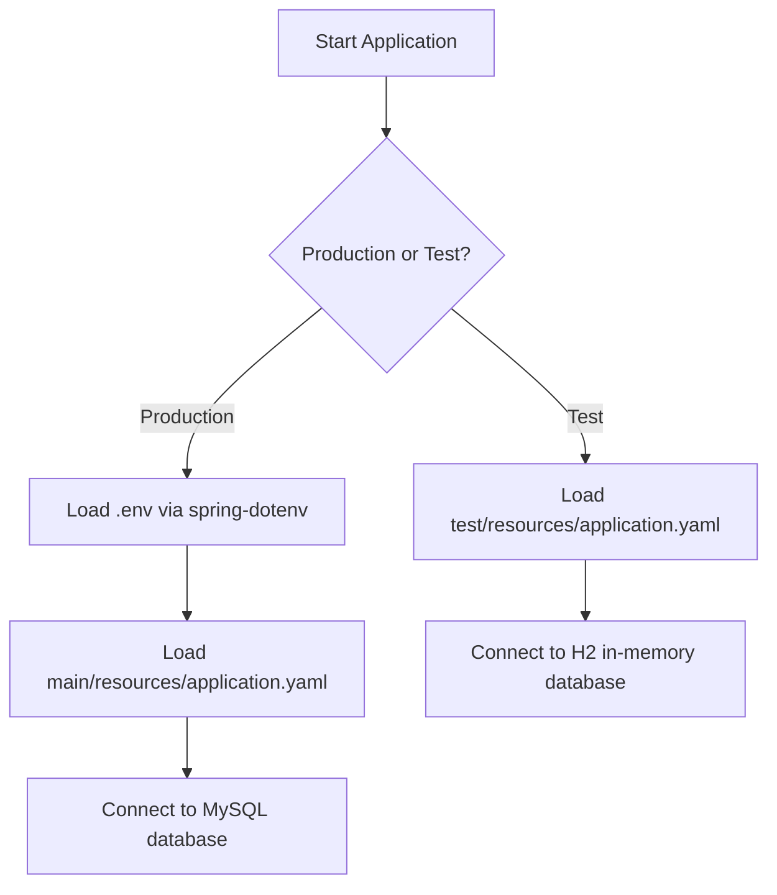
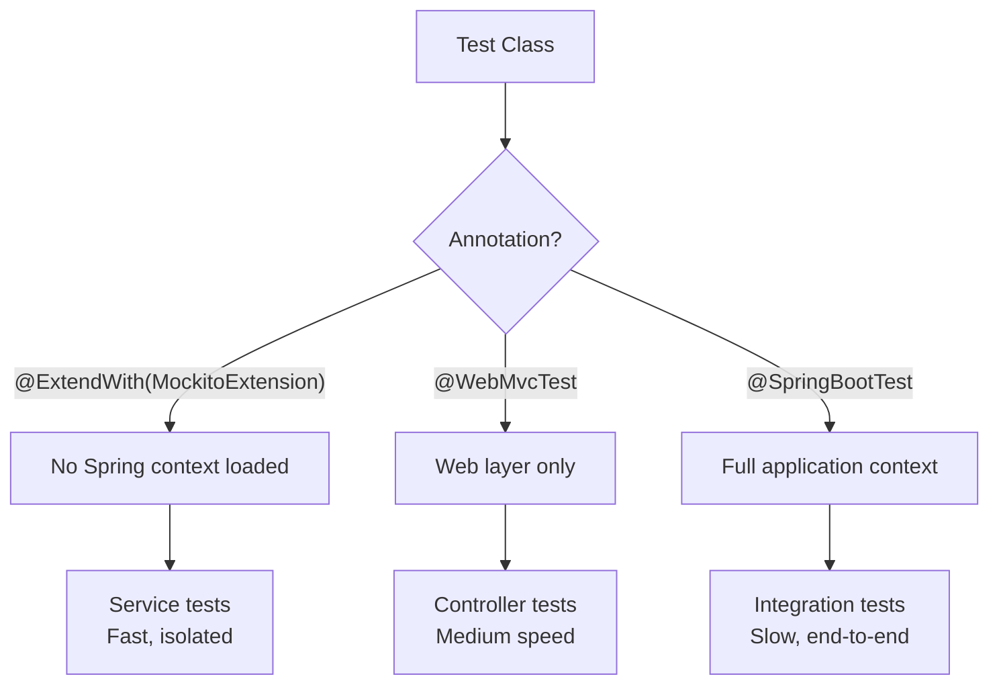
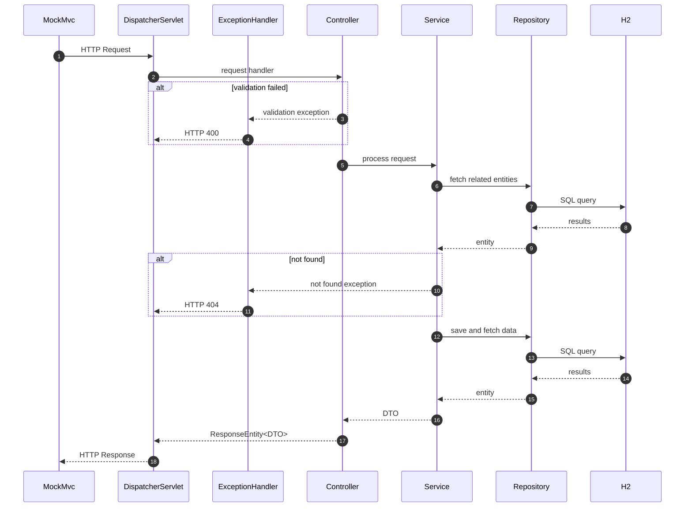

# starzz-boot


This project is a production-style REST API built with Spring Boot, designed to demonstrate clean backend architecture, maintainable service-layer logic, and real-world API design patterns.  It demonstrates a backend design using MVC architecture, layered services, DTO mapping, validation, exception handling, and database integration with MySQL.

This project serves two purposes:

**Portfolio showcase**: A clear example of building a maintainable, production-ready Spring Boot API.

**Learning resource**: A guided walkthrough for developers familiar with Spring Boot, showing why each layer exists and how the components interact.

The API manages a database of fictional galaxies, constellations, and stars. You’ll see how entities, DTOs, mappers, services, and controllers work together to process requests and return structured responses.
Mermaid diagrams illustrate request flows, allowing readers to quickly grasp the architecture while detailed explanations provide deeper insight.

## Features

- REST API built with Spring Boot
- MVC architecture with layered services (Controller → Service → Repository)
- DTO mapping between entities and responses
- Validation using Jakarta Bean Validation
- Global exception handling
- MySQL database with Spring Data JPA
- Unit testing using JUnit 5 and Mockito
- Integration testing using Spring Boot Test and H2
- Postman collection included
- Architecture diagrams using Mermaid

## Key Design Decisions

- **DTO over Entity exposure**  
  Prevents tight coupling between API and database schema.

- **Service layer abstraction**  
  Keeps controllers thin and business logic centralized.

- **Manual mapping instead of MapStruct**  
  Improves transparency for learning purposes.

- **No user deletion**  
  Preserves referential integrity in a legacy schema.

- **Lazy loading for relationships**
  Avoids unnecessary database queries.

- **`@Transactional` on mutating integration tests**
  Rolls back after each test to keep the seeded dataset intact, preventing test interference.

- **H2 with `MODE=MySQL`**
  Allows reuse of the existing `load.sql` seed script without modification, keeping a single source of truth for test data.

## The Dataset

Here is a diagram to describe the tables and their relationships:


Stars are located in constellations, which are in turn located in galaxies.

The `galaxies`, `constellations` and `stars` tables contain the additional
fields `added_by` and `verified_by` to indicate the id of the users who made
the finding and verified it, respectively.

The database was created in MySQL.  The scripts to create the tables and
load the dummy data are included in `assets` for reference.

Our assumption is that we are working with a legacy database that cannot easily be altered.

## Test Coverage

The application is covered by both unit tests and integration tests. Unit tests cover the service and controller layers in isolation using JUnit 5 and Mockito. Integration tests verify the full request lifecycle — from HTTP request through controller, service, repository, and H2 database — using `@SpringBootTest` and `MockMvc`. Overall line coverage is **99.6%**, with the only uncovered code being the single-line main method in `StarzzBootApplication.java`.


The above report was generated by IntelliJ's built-in coverage report generator.

## The Application

This project was created in IntelliJ IDEA Ultimate.  It uses Java, Spring Boot, Maven and MySQL.

First we create a new Spring Boot project.  Instead of manual setup from [https://start.spring.io],
we use IntelliJ:


We don't add any dependencies for now; we will add them as we go along.


> **Note:** The screenshot shows Spring Boot 4.0.2, which was the version used at project creation. This project has since been migrated to Spring Boot 3.4.5 for better ecosystem support and documentation availability.

After clicking **Create**, IntelliJ generates starter project files (the project also includes Maven):


All code committed at each chapter is available with the commit message of the chapter name.

### Chapter 1: Setting up the routes

Project dependencies added:

    Spring Web
    Lombok

#### Overview

```mermaid
sequenceDiagram
    autonumber

    actor User
    participant DispatcherServlet
    participant Controller

    User ->> DispatcherServlet: HTTP Request
    DispatcherServlet ->> Controller: HTTP Request
    Controller -->> DispatcherServlet: 200 OK
    DispatcherServlet -->> User: HTTP Response
 ```

#### Endpoints

| Endpoint                | Method | Description                                              | Response |
|-------------------------|--------|----------------------------------------------------------|----------|
| `/constellations`       | GET    | Returns *Successfully called getConstellationList()*     | 200 OK   |
| `/constellations/{id}`  | GET    | Returns *Successfully called getConstellation(id)*       | 200 OK   |
| `/constellations`       | POST   | Returns *Successfully called registerConstellation()*    | 200 OK   |
| `/constellations/{id}`  | PUT    | Returns *Successfully called updateConstellation(id)*    | 200 OK   |
| `/constellations/{id}`  | DELETE | Returns *Successfully called deleteConstellation(id)*    | 200 OK   |
| `/galaxies`             | GET    | Returns *Successfully called getGalaxyList()*            | 200 OK   |
| `/galaxies/{id}`        | GET    | Returns *Successfully called getGalaxy(id)*              | 200 OK   |
| `/galaxies`             | POST   | Returns *Successfully called registerGalaxy()*           | 200 OK   |
| `/galaxies/{id}`        | PUT    | Returns *Successfully called updateGalaxy(id)*           | 200 OK   |
| `/galaxies/{id}`        | DELETE | Returns *Successfully called deleteGalaxy(id)*           | 200 OK   |
| `/stars`                | GET    | Returns *Successfully called getStarList()*              | 200 OK   |
| `/stars/{id}`           | GET    | Returns *Successfully called getStar(id)*                | 200 OK   |
| `/stars`                | POST   | Returns *Successfully called registerStar()*             | 200 OK   |
| `/stars/{id}`           | PUT    | Returns *Successfully called updateStar(id)*             | 200 OK   |
| `/stars/{id}`           | DELETE | Returns *Successfully called deleteStar(id)*             | 200 OK   |
| `/users`                | GET    | Returns *Successfully called getUserList()*              | 200 OK   |
| `/users/{id}`           | GET    | Returns *Successfully called getUser(id)*                | 200 OK   |
| `/users`                | POST   | Returns *Successfully called registerUser()*             | 200 OK   |
| `/users/{id}`           | PUT    | Returns *Successfully called updateUser(id)*             | 200 OK   |
| `/users/{id}`           | DELETE | Returns *Successfully called deleteUser(id)*             | 200 OK   |

*A Postman collection for all routes is included in* `assets/starzz-boot.postman_collection.json`

#### Sample Responses

GET /constellations
```json
{
    "text: "Successfully called getConstellationList()"
}
```

GET /constellations/100

```json
{
    "text: "Successfully called getConstellation(100)"
}
```

GET /galaxies

```json
{
    "text: "Successfully called getGalaxyList()"
}
```

GET /galaxies/100

```json
{
    "text: "Successfully called getGalaxy(100)"
}
```

GET /stars

```json
{
    "text: "Successfully called getStarList()"
}
```

GET /stars/100

```json
{
    "text: "Successfully called getStar(100)"
}
```

GET /users

```json
{
    "text: "Successfully called getUserList()"
}
```

GET /users/100

```json
{
    "text: "Successfully called getUser(100)"
}
```

#### Chapter Summary

This chapter sets up the foundation of the Spring Boot application and demonstrates the basic routing and controller structure. It shows how requests flow from the DispatcherServlet to controllers and how endpoints are defined using the MVC pattern. Hardcoded responses are used to verify routing, providing a clear view of how controllers handle HTTP requests. By the end, the project has a working skeleton API that illustrates the architecture and request flow.

<details>

<summary>Chapter Walkthrough</summary>

A Spring Boot application follows the MVC pattern for web applications.  So to build our application,
we add the **Spring Web** dependency in `pom.xml`. When we add a dependency in `pom.xml`, Maven
resolves and downloads it automatically from the configured repositories.

```xml
<dependency>
    <groupId>org.springframework.boot</groupId>
    <artifactId>spring-boot-starter-web</artifactId>
</dependency>
```

(We remove the version number so Spring Boot can manage versioning for us).

We also add **Lombok** for automatic generation of getters, setters, constructors, etc.:

```xml
<dependency>
    <artifactId>lombok</artifactId>
    <groupId>org.projectlombok</groupId>
    <scope>annotationProcessor</scope>
</dependency>
```

(We add the scope because Lombok is only needed during compilation and shouldn't exist at runtime)

> **Note:** Whenever you add a dependency to `pom.xml`, click the Load Maven Changes button (the elephant icon) in IntelliJ to download it.
  
For now, we will be referring to the `src/main/java` folder of our project.  We will talk about
`src/test/java` later.

One of the auto-generated files in our project is `StarzzBootApplication.java` in package
`com.sanjayrisbud.starzzboot`:

    ... 
    @SpringBootApplication
    public class StarzzBootApplication {
    
        public static void main(String[] args) {
            SpringApplication.run(StarzzBootApplication.class, args);
        }
    
    }

This file defines the class `StarzzBootApplication`, which serves as the entrypoint to our
application.  The `@SpringBootApplication` annotation enables component scanning, which instructs
Spring to discover and register application components as **beans** within the application context.

In Spring, a bean is an object whose lifecycle is managed by the Spring container. Classes
annotated with `@RestController`, `@Service`, or `@Component` are automatically detected as
beans and can be injected where needed.

We now define our application's endpoints.  First we define a class to hold plain responses to
requests to our API endpoints.  In package `com.sanjayrisbud.starzzboot` we add a new package,
`dtos`.  In this package we create a class `Message`:

    @AllArgsConstructor
    @Getter
    @ToString
    public class Message {
        private String text;
    }

We annotate the class with `@AllArgsConstructor`, `@Getter` and `@ToString` so Lombok will
generate a constructor, getter and toString() method for us.

When an instance of this class is returned as a response to an HTTP request, Spring Boot takes
care of serializing the instance to JSON.  When an instance of the class is expected as a
parameter to a method, Spring Boot takes care of deserializing the supplied JSON argument to the
needed instance.

We now define classes that would handle HTTP requests to our different API endpoints and
respond accordingly.  In package `com.sanjayrisbud.starzzboot` we add a new package,
`controllers`.  This package will contain the classes that will handle the requests.

A sample class in the `controllers` package is `ConstellationController`:

    ...
    @RestController
    @RequestMapping("/constellations")
    public class ConstellationController {
        @GetMapping
        public Message getConstellationList() {
            return new Message("Successfully called getConstellationList()");
        }
    
        @GetMapping("/{id}")
        public Message getConstellation(@PathVariable Long id) {
            return new Message("Successfully called getConstellation(" + id + ")");
        }
    
        @PostMapping
        public Message registerConstellation(@RequestBody Message request) {
            return new Message("Successfully called registerConstellation(" + request + ")");
        }
    ...

We annotate the class with `@RestController`, which marks the class as a controller where every
method returns a domain object instead of an HTML view.  The `@RequestMapping` annotation
specifies the prefix of the endpoints that the class handles, in this case, `/constellations`.

The mapping annotations (`@GetMapping`, `@PostMapping`, `@PutMapping` and `@DeleteMapping`)
specify the HTTP verb (*GET, POST, PUT* or *DELETE*) that the class method handles.  The
remainder of the handled URL, i.e. after the prefix, is passed as an argument to the annotation.

For the class methods that have parameters, the annotation `@PathVariable` indicates that the
argument is from the mapping annotation's argument (inside the curly braces).  The `@RequestBody`
annotation indicates that the argument is from the body of the request.

The other classes in the `controllers` package follow a similar logic.

So far, our controllers return hardcoded responses. While this is useful to verify that our
routing layer works correctly, real-world applications persist and retrieve data from a database.

In the next chapter, we introduce the persistence layer using Spring Data JPA and connect our
application to a MySQL database.

</details>

### Chapter 2: Setting up the database

Project dependencies added:

    Spring Data JPA
    MySQL Driver
    Jakarta Bean Validation

#### Overview

##### HTTP GET



##### HTTP POST/PUT



##### HTTP DELETE



#### Updated Endpoints

| Endpoint                | Method | Description                                              | Response       |
|-------------------------|--------|----------------------------------------------------------|----------------|
| `/constellations`       | GET    | Returns the list of constellations                       | 200 OK         |
| `/constellations/{id}`  | GET    | Returns the constellation with the ID of *id*            | 200 OK         |
| `/constellations`       | POST   | Creates a new constellation record                       | 201 Created    |
| `/constellations/{id}`  | PUT    | Updates the constellation with the ID of *id*            | 200 OK         |
| `/constellations/{id}`  | DELETE | Deletes the constellation with the ID of *id*            | 204 No Content |
| `/galaxies`             | GET    | Returns the list of galaxies                             | 200 OK         |
| `/galaxies/{id}`        | GET    | Returns the galaxy with the ID of *id*                   | 200 OK         |
| `/galaxies`             | POST   | Creates a new galaxy record                              | 201 Created    |
| `/galaxies/{id}`        | PUT    | Updates the galaxy with the ID of *id*                   | 200 OK         |
| `/galaxies/{id}`        | DELETE | Deletes the galaxy with the ID of *id*                   | 204 No Content |
| `/stars`                | GET    | Returns the list of stars                                | 200 OK         |
| `/stars/{id}`           | GET    | Returns the star with the ID of *id*                     | 200 OK         |
| `/stars`                | POST   | Creates a new star record                                | 201 Created    |
| `/stars/{id}`           | PUT    | Updates the star with the ID of *id*                     | 200 OK         |
| `/stars/{id}`           | DELETE | Deletes the star with the ID of *id*                     | 204 No Content |
| `/users`                | GET    | Returns the list of users                                | 200 OK         |
| `/users/{id}`           | GET    | Returns the user with the ID of *id*                     | 200 OK         |
| `/users`                | POST   | Creates a new user record                                | 201 Created    |
| `/users/{id}`           | PUT    | Updates the user with the ID of *id*                     | 200 OK         |

*The Postman collection in* `assets/starzz-boot.postman_collection.json` *has been updated to the
format of requests used in this chapter.*

*A Note on User Deletion* - The application **does not** provide a *DELETE* endpoint for users.
This is a deliberate design decision:

- Users are referenced by galaxies, constellations, and stars (`addedBy` and `verifiedBy`).
- Cascading delete through these relationships would risk data loss and long transactional operations.
- The existing database schema cannot be modified to add a soft-delete flag (`isActive`), so soft deletion is not possible.
- Therefore, user deletion is intentionally disabled to preserve historical data integrity.

#### Sample Responses

GET /constellations

```json
[
    {
        "constellationId": 1,
        "constellationName": "Pleiades"
    },
    {
        "constellationId": 2,
        "constellationName": "Orion"
    }
]
```

GET /constellations/100

```json
{
    "constellationId": 100,
    "constellationName": "Cassopeia",
    "galaxy": {
        "galaxyId": 1,
        "galaxyName": "Andromeda"
    },
    "addedBy": {
        "userId": 10,
        "username": "mike14288"
    },
    "verifiedBy": {
        "userId": 37,
        "username": "centwhistle45939"
    }
}
```

GET /galaxies

```json
[
    {
        "galaxyId": 1,
        "galaxyName": "Andromeda"
    },
    {
        "galaxyId": 2,
        "galaxyName": "Poseidon"
    }
]
```

GET /galaxies/100

```json
{
    "galaxyId": 100,
    "galaxyName": "Valhalla",
    "galaxyType": "Barred Spiral",
    "distanceMly": 5096,
    "redshift": 4,
    "massSolar": 5434403,
    "diameterLy": 647254,
    "addedBy": {
        "userId": 15,
        "username": "rtavener27922"
    },
    "verifiedBy": {
        "userId": 62,
        "username": "kchatres44202"
    }
}
```

GET /stars

```json
[
    {
        "starId": 1,
        "starName": "Sol"
    },
    {
        "starId": 2,
        "starName": "Rigel"
    }
]
```

GET /stars/100

```json
{
    "starId": 100,
    "starName": "Centaur",
    "starType": "red dwarf star",
    "constellation": {
        "constellationId": 38,
        "constellationName": "Canis Minor"
    },
    "rightAscension": 10,
    "declination": 78,
    "apparentMagnitude": -12,
    "spectralType": "O",
    "addedBy": {
        "userId": 1,
        "username": "ebalducci29128"
    },
    "verifiedBy": {
        "userId": 89,
        "username": "ogarriock20720"
    }
}
```

GET /users

```json
[
    {
        "userId": 1,
        "username": "ebalducci29128"
    },
    {
        "userId": 2,
        "username": "ldilloway50275"
    }
]
```

GET /users/100

```json
{
    "userId": 100,
    "username": "tperazzo50392",
    "email": "torey.perazzo@yahoo.com",
    "firstName": "Torey",
    "lastName": "Perazzo",
    "dateOfBirth": "1998-05-26"
}
```

#### Chapter Summary

This chapter introduces the persistence layer and connects the application to a MySQL database. Entities, JPA annotations, and relationships are defined, along with DTOs for clean data transfer. The repository and service layers are implemented to manage database interactions, and controllers are connected to services to handle requests and responses. Validation, exception handling, and structured response patterns are also included, making the API fully functional with proper separation of concerns.

<details>

<summary>Chapter Walkthrough</summary>

To persist and retrieve data, we now introduce a persistence layer. In Spring Boot applications,
this is typically achieved using Spring Data JPA on top of a relational database.  In our case,
it is our **starzz** database on MySQL.

To allow our application to interact with the database, we would first need to add the
**MySQL driver** to allow our code to execute SQL via JDBC (JDBC is a low-level API
for accessing databases):

```xml
<dependency>
    <groupId>com.mysql</groupId>
    <artifactId>mysql-connector-j</artifactId>
    <scope>runtime</scope>
</dependency>
```

(We add the scope because the driver is only needed at runtime and not needed to compile the code)

The MySQL driver enables JDBC connectivity. We also add **Spring Data JPA** to provide
higher-level, object-oriented database interaction.  (We use Spring Data JPA to
interact with the database in an object-oriented way. Hibernate, the default JPA
implementation, handles the actual SQL generation and persistence management.)

```xml
<dependency>
    <groupId>org.springframework.boot</groupId>
    <artifactId>spring-boot-starter-data-jpa</artifactId>
</dependency>
```

Since data that we add to the database comes from user input in the requests, we would
need to validate them before modifying the database.  We add **Jakarta Bean Validation** to
implement request validation:

```xml
<dependency>
    <groupId>org.springframework.boot</groupId>
    <artifactId>spring-boot-starter-validation</artifactId>
</dependency>
```

We add the snippets above to `pom.xml`.

With dependencies added, we now configure our data source so Spring Boot can connect to the MySQL
database.  In `src/main/resources/application.yaml` we add the application's data source:

```yaml
spring:
    datasource:
        url: jdbc:mysql://localhost:3306/starzz
        username: root
        password: <your database password>
    jpa:
        show-sql: true
```

(`username` and `password` are the credentials to our database server, accessible via `url`.
We also set `show-sql` under `jpa` to `true` so the application will log the SQL that
Hibernate generates.)

We now create our code to interact with our database.

Since Spring Data JPA allows us to work with database tables in an object-oriented way, we can
add classes to abstract tables and the operations on them.  In `com.sanjayrisbud.starzzboot`,
we add a new package, `models`, to contain the table abstractions.  An example class is
`Constellation`:

    ...
    @Entity
    @AllArgsConstructor
    @NoArgsConstructor
    @Builder
    @Getter
    @Setter
    @Table(name = "constellations")
    public class Constellation {
        @Id
        @GeneratedValue(strategy = GenerationType.IDENTITY)
        @Column(name = "constellation_id")
        private Integer id;
    
        @Column(name = "constellation_name")
        private String name;
    ...

The `@Entity` annotation specifies that the class is an abstraction of a database table, and
`@Table` specifies the actual table name.  Each instance of this class represents one record
in the table.  `@AllArgsConstructor`, `@NoArgsConstructor`, `@Getter` and `@Setter` are for
Lombok to generate a constructor requiring all fields, a default constructor, getters and setters
for all fields, respectively (these Lombok-generated methods are needed by Spring Data JPA).
`@Builder` (also from Lombok) allows us to create an entity instance using the **Builder**
pattern i.e. one field at a time.  This improves readability by showing which values are
assigned to which fields.

We then have fields with `@Column` corresponding to the table columns.  `@Id` indicates the
primary key and `@GeneratedValue` indicates that the value is generated by the table.

We then define relationships with other entities.  Schema-wise, we have a many-to-one relationship
between `constellations` and `galaxies`; the foreign key is `galaxy_id`  We express that relationship
using:

    ...
    @ManyToOne(fetch = FetchType.LAZY)
    @JoinColumn(name = "galaxy_id")
    private Galaxy galaxy;
    ...

Our entity for the `galaxies` table is `Galaxy`; we define a field `galaxy` to refer to it.  Since
this field uses a foreign key to refer to the parent `Galaxy` we annotate the field with
`@JoinColumn` to specify the foreign key.  `@ManyToOne` specifies the relationship i.e. many to one.
For these types of relationships, the default behavior of Spring Data JPA when it loads a particular entity into memory is to automatically fetch the related entity.  This is called eager loading.  In our
case, we indicate `fetch` to override this default and tell Spring Data JPA to fetch the related
entity only when we explicitly ask for it, which is called lazy loading.

In addition, this field has a symmetric field in the entity `Galaxy`:

    @OneToMany(targetEntity = Constellation.class, mappedBy = "galaxy", cascade = CascadeType.REMOVE)
    private Set<Constellation> constellations = new HashSet<>();

This field does not correspond to a physical column in the `galaxies` table; it represents the
inverse side of the relationship.  It is a field for the set of its children `Constellation`
objects.  `@OneToMany` specifies  the relationship, `targetEntity` indicates the related entity,
and `mappedBy` indicates the symmetric field.  `cascade` specifies what operations on the parent
cascade to the children entities; in this case, deleting a galaxy also deletes its children
constellations.

Two other fields in `Constellation` are defined similarly:

    ...
    @ManyToOne(fetch = FetchType.LAZY)
    @JoinColumn(name = "added_by")
    private User addedBy;

    @ManyToOne(fetch = FetchType.LAZY)
    @JoinColumn(name = "verified_by")
    private User verifiedBy;
    ...

The symmetric fields in the `User` entity corresponding to the table `users`:

    @OneToMany(targetEntity = Constellation.class, mappedBy = "addedBy")
    private Set<Constellation> constellationsAdded = new HashSet<>();

    @OneToMany(targetEntity = Constellation.class, mappedBy = "verifiedBy")
    private Set<Constellation> constellationsVerified = new HashSet<>();

The other classes in the `models` package follow a similar logic.

Now that we have defined our entities as object-oriented representations of database tables,
we introduce the repository layer.  While entities abstract the structure of our tables,
repositories abstract the operations performed on those entities. They provide a clean interface
for querying, saving, updating, and deleting data without requiring us to write SQL manually.

Our repositories extend the interface `JpaRepository`. Spring Data JPA automatically generates
implementations of these interfaces at runtime and registers them as beans in the application
context. This allows the repositories to be injected into services or controllers where needed.

In `com.sanjayrisbud.starzzboot`, we add a new package, `repositories`, to contain the repositories.
An example interface is`ConstellationRepository`:

    ...
    public interface ConstellationRepository extends JpaRepository<Constellation, Integer> {
    }

The other interfaces in the `repositories` package follow a similar logic.

Whenever we send data as part of responses, we usually don't send raw entities from our database.
We create mappings from our entities to custom objects, and send those objects instead.  These
custom objects are known as data transfer objects.  We need to create DTOs for our entities.
In `com.sanjayrisbud.starzzboot.dtos`, we add our DTOs.  An example class is `ConstellationSummaryDto`:

    ...
    public record ConstellationSummaryDto (
        Integer constellationId,
        String constellationName
    ) {}

Since we only need fields for the constellation's id and name, we define this class as a
`record` instead.  This guarantees immutability and clearly signifies its intent as a
data carrier.

Another example is `ConstellationDetailsDto`:

    ...
    @Builder
    @Data
    @JsonPropertyOrder({
        "constellationId",
        "constellationName",
        "galaxy",
        "addedBy",
        "verifiedBy"
    })
    public class ConstellationDetailsDto {
        private Integer constellationId;
        private String constellationName;
        private GalaxySummaryDto galaxy;
        private UserSummaryDto addedBy;
        private UserSummaryDto verifiedBy;
    }

This DTO has additional fields to display the parent galaxy, and the adder and verifier.  These
fields are themselves DTOs.  `@JsonPropertyOrder` specifies the order of the fields in the DTO
serialization.  `@Data` tells Lombok to generate boilerplate code such as getters, setters, equals,
hashCode, and toString.  Although the class only carries data, we define it as a regular class instead
of a record because we construct instances using the builder pattern, which allows fields to be set
more flexibly.  We specify this using `@Builder`.

We also have a DTO to accept JSON input when processing requests to add or update constellations:

    @Builder
    @Data
    public class ConstellationDto {
        @NotBlank private String constellationName;
        @NotNull private Integer galaxyId;
        @NotNull private Integer adderId;
        private Integer verifierId;
    }

We add validation annotations to the fields.  `@NotNull` specifies that the field must be present
and cannot be set to `null`.  `@NotBlank` specifies that the field must be present and cannot be
`null`, blank, or an empty string.  When all the validations pass, the JSON is deserialized to
a DTO instance.

The other classes in the `dtos` package follow a similar logic.

We would then need classes to map entities to DTOs.  The **MapStruct** dependency can help
generate mappings for us, but for the purposes of this application we will generate them manually.
In `com.sanjayrisbud.starzzboot`, we add a new package, `mappers`, to contain the classes for
our entity mappers.  An example class is `ConstellationMapper`:

    ...
    @AllArgsConstructor
    @Component
    public class ConstellationMapper {
        private final GalaxyMapper galaxyMapper;
        private final UserMapper userMapper;
    
        public ConstellationSummaryDto toSummaryDto(Constellation constellation) {
            if (constellation == null)
                return null;
    
            return new ConstellationSummaryDto(constellation.getId(), constellation.getName());
        }

        public ConstellationDetailsDto toDetailsDto(Constellation constellation) {
            if (constellation == null)
                return null;
    
            var galaxy = galaxyMapper.toSummaryDto(constellation.getGalaxy());
            var addedBy = userMapper.toSummaryDto(constellation.getAddedBy());
            var verifiedBy = userMapper.toSummaryDto(constellation.getVerifiedBy());
    
            return ConstellationDetailsDto.builder()
                    .constellationId(constellation.getId())
                    .constellationName(constellation.getName())
                    .galaxy(galaxy)
                    .addedBy(addedBy)
                    .verifiedBy(verifiedBy)
                    .build();
        }
    }

`@Component` tags this class as a bean.  In `toSummaryDto()` we create a summary DTO using a regular
constructor.  In `toDetailsDto()` we first get summary DTOs of the related entities, then use the
builder pattern to create the details DTO one field at a time.

The other classes in the `mappers` package follow a similar logic.

Whenever our application processes requests, errors may occur, e.g. a request for a nonexistent
constellation.  Instead of letting the application fail silently, we throw exceptions to convey
information about these events.  We do this with exception handling.  In package
`com.sanjayrisbud.starzzboot.dtos` we add a new class, `ErrorResponseDto`, to contain the
error message:

    ...
    public record ErrorResponseDto(
        String message,
        LocalDateTime timestamp
    ) {}

It has fields for the error message and the error's timestamp.

In `com.sanjayrisbud.starzzboot`, we add a new package, `exceptions`, to contain the classes
for our exception handling.  We create class `ResourceNotFoundException`:

    ...
    @Getter
    public class ResourceNotFoundException extends RuntimeException {
    
        private final String resourceName;
        private final Integer resourceId;
    
        public ResourceNotFoundException(String resourceName, Integer resourceId) {
            super(resourceName + " with id " + resourceId + " not found.");
            this.resourceName = resourceName;
            this.resourceId = resourceId;
        }
    
    }

This will be the custom exception thrown whenever our application searches for nonexistent
resources.

In the same package, we create class `GlobalExceptionHandler`:

    ...
    @RestControllerAdvice
    public class GlobalExceptionHandler {
    
        @ExceptionHandler(ResourceNotFoundException.class)
        public ResponseEntity<ErrorResponseDto> handleNotFound(ResourceNotFoundException ex) {
    
            var errorResponse = new ErrorResponseDto(ex.getMessage(), LocalDateTime.now());
    
            return ResponseEntity.status(HttpStatus.NOT_FOUND).body(errorResponse);
        }
    }
    ...

The `@RestControllerAdvice` annotation makes this class handle all our custom exceptions.
`@ExceptionHandler` specifies the method to handle specific exception classes.  In this case,
`handleNotFound()` is the handler for `ResourceNotFoundException`.  There are also handlers
for validation exceptions thrown by Spring Boot.

We now introduce a service layer to contain our application's business logic.  Introducing a
service layer ensures a clean separation of concerns; controllers can focus solely on HTTP
request handling and not need to worry about the business rules.

In `com.sanjayrisbud.starzzboot`, we add a new package, `services`, to contain the classes for our
service layer.  An example class is `ConstellationService`:

    ...
    @AllArgsConstructor
    @Service
    public class ConstellationService {
        private final ConstellationRepository constellationRepository;
        private final ConstellationMapper constellationMapper;
        private final GalaxyService galaxyService;
        private final UserService userService;
        
        public List<ConstellationSummaryDto> getConstellationList() {
            return constellationRepository.findAll().stream()
                    .map(constellationMapper::toSummaryDto)
                    .toList();
        }
    
        public ConstellationDetailsDto getConstellation(Integer id) {
            return constellationMapper.toDetailsDto(findById(id));
        }
    
        public ConstellationDetailsDto registerConstellation(ConstellationDto request) {
            var constellation = Constellation.builder()
                    .name(request.getConstellationName())
                    .galaxy(galaxyService.getEntity(request.getGalaxyId(), null))
                    .addedBy(userService.getEntity(request.getAdderId(), null))
                    .verifiedBy(userService.getEntity(request.getVerifierId(),null))
                    .build();
    
            constellationRepository.save(constellation);
            return constellationMapper.toDetailsDto(constellation);
        }
    ...

`@Service` specifies that this class is a bean.  It has private fields for beans, which were
automatically injected by Spring.  We then define methods to implement CRUD operations.

The other classes in the `services` package follow a similar logic.

Finally, we rewrite our `ConstellationController`:

    ...
    @AllArgsConstructor
    @RestController
    @RequestMapping("/constellations")
    public class ConstellationController {
    
        private final ConstellationService constellationService;
    
        @GetMapping
        public List<ConstellationSummaryDto> getConstellationList() {
            return constellationService.getConstellationList();
        }
    
        @GetMapping("/{id}")
        public ResponseEntity<ConstellationDetailsDto> getConstellation(@PathVariable Integer id) {
            return ResponseEntity.ok(constellationService.getConstellation(id));
        }
    
        @PostMapping
        public ResponseEntity<ConstellationDetailsDto> registerConstellation(
                @Valid @RequestBody ConstellationDto request,
                UriComponentsBuilder uriBuilder) {
            var newConstellation = constellationService.registerConstellation(request);
            var uri = uriBuilder.path("/constellations/{id}")
                    .buildAndExpand(newConstellation.getConstellationId()).toUri();
            return ResponseEntity.created(uri).body(newConstellation);
        }
    ...

We introduce a private field for the service bean.  When the endpoint handlers receive requests,
they now redirect those requests to different methods in the service bean, and then generate
appropriate responses based on the results of those methods.  Instead of returning DTOs directly,
the controller methods now return a `ResponseEntity<T>`, a generic wrapper that allows us to
specify the HTTP status code and response body.

The other classes in the `controllers` package follow a similar logic.

Now that we’ve finished setting up the database and our controllers, our app is starting to grow.
With more pieces working together, it’s easy to accidentally break something when we add new
features. That’s why it’s a good idea to start writing **unit tests** now — they help us make
sure each part works on its own and keep everything running smoothly as the project grows.

Before we write tests, we need to make a couple of enhancements to our persistence layer.  In the next chapter, we enable our application to retrieve secrets from a `.env` file instead of putting them directly in `application.yaml`.  We also setup **H2**, an in-memory database that our tests can use instead of our MySQL database.

</details>

### Chapter 3: Setting up persistence layer enhancements

Project dependencies added:

    Spring Dotenv
    H2 Database Engine

#### Overview



#### Chapter Summary

This chapter enhances the persistence layer in two ways. First, database credentials are moved out of `application.yaml` and into a `.env` file, keeping secrets out of version control. Second, an H2 in-memory database is configured for the test environment, ensuring that automated tests run in isolation without touching the production MySQL database.

<details>

<summary>Chapter Walkthrough</summary>

To interact with other systems, our application depends on secrets such as database credentials.  Currently, these secrets are stored in `application.yaml`.  This is not recommended.  For security, we should instead store secrets in a secrets repository and make `application.yaml` read the secrets from there.  For our project, we use a `.env` file as our secrets repository.  To enable our application to read `.env` files, we need the **Spring Dotenv** dependency.  We add this to `pom.xml`:

```xml
<dependency>
    <groupId>me.paulschwarz</groupId>
    <artifactId>spring-dotenv</artifactId>
    <version>3.0.0</version>
</dependency>
```

(We specify the version number because this is a third party dependency and not managed by Spring Boot).

We create a file `.env` in the root of our project, containing:

```bash
DB_URL=jdbc:mysql://localhost:3306/starzz
DB_USERNAME=root
DB_PASSWORD=<your database password>
```

And modify `src/main/resources/application.yaml` to refer to `.env`:

```yaml
spring:
    application:
        name: starzz-boot
    datasource:
        url: ${DB_URL}
        username: ${DB_USERNAME}
        password: ${DB_PASSWORD}
    jpa:
        show-sql: true
```

We now setup our in-memory database.

Open `src/test/java/com/sanjayrisbud/starzzboot/StarzzBootApplicationTests.java`.  This is a starter test file automatically created by IntelliJ.  

    ...
    @SpringBootTest
    class StarzzBootApplicationTests {

        @Test
        void contextLoads() {
        }

    }

Briefly, `@SpringBootTest` is used to create a test environment.  It looks for the main class (which has `@SpringBootApplication`) and uses it to start the application context.

When we execute the file, notice:


It simply loads the application and then exits.  However, reading trough the logs, we see the *Database version: 9.6*.  We know that our underlying database is *MySQL 9.6*.  Since the logs don't say otherwise, we can assume that our test environment uses our MySQL database.  This is not ideal.  We want our automated tests to use a different database from production so our tests don't pollute the production database.  In addition, we prefer that our test database be located in memory rather than a physical database so our tests execute faster.

This is where H2 can help.  It is a lightweight and fast SQL database written in Java. It is particularly useful for testing and development because it allows you to create a temporary database that is automatically destroyed when the application stops.  To enable our application to use H2 for testing, we add the **H2 Database Engine** dependency to `pom.xml`:

```xml
<dependency>
    <groupId>com.h2database</groupId>
    <artifactId>h2</artifactId>
    <scope>test</scope>
</dependency>
```

We then create a new file `src/test/resources/application.yaml`:

```yaml
spring:
    datasource:
        url: jdbc:h2:mem:testdb
        username: sa
        password:
        driver-class-name: org.h2.Driver
    jpa:
        hibernate:
            ddl-auto: create-drop
        show-sql: true
    h2:
        console:
            enabled: true
```

Unlike `src/main/resources/application.yaml`, this file does not reference `.env` variables — H2 credentials are hardcoded since they are not real secrets. It also includes H2-specific settings: `driver-class-name` to specify the H2 driver, `ddl-auto: create-drop` to automatically create the schema at the start of each test run and drop it at the end, and `h2.console.enabled` to enable the H2 web console for inspection during development.

When we execute `src/test/java/com/sanjayrisbud/starzzboot/StarzzBootApplicationTests.java`, notice:


We now see several logs containing *SQL CREATE, ALTER* and *DROP*, implying that a blank copy of our database is being created (Hibernate is able to do this by inspecting our data repository beans).  The *H2 console...* log confirms that the test database is indeed the H2 database.

We have now completed setting up testing prerequisites.  In the next chapter, we’ll dive into **unit testing** using **JUnit 5** and **Mockito**.  We’ll cover how to test our services and controllers, mock dependencies, and build a solid foundation so future updates won’t surprise us.

</details>

### Chapter 4: Setting up unit tests

Project dependencies added:

    None

#### Overview



#### Chapter Summary

This chapter introduces unit testing using JUnit 5 and Mockito. Service layer tests are written using `@ExtendWith(MockitoExtension.class)`, with repositories and external services mocked and mappers used as real instances via `@Spy`. Controller tests use `@WebMvcTest` to test the web layer in isolation, with services replaced by Mockito mocks via `@MockitoBean`.

<details>

<summary>Chapter Walkthrough</summary>

To test our application, we will use **JUnit 5** and **Mockito**. JUnit 5 provides the framework
to write and run unit tests, while Mockito allows us to create mocks of our dependencies so we
can test each layer in isolation. To use them in our project, we need the `spring-boot-starter-test`
dependency.  However, we don’t need to manually add this dependency to our `pom.xml`.  When we
created the project, the dependency had already been added to `pom.xml`:

```xml
<dependency>
    <groupId>org.springframework.boot</groupId>
    <artifactId>spring-boot-starter-test</artifactId>
    <scope>test</scope>
</dependency>
```

(The scope specifies that the dependency is only needed during testing and won't be included when
the application package is built.)

We will use **WebMvcTest** to test our controllers.  In Spring Boot 3, `@WebMvcTest` support is already included in `spring-boot-starter-test`, so no additional dependency is needed.

Up until now, we have been writing all our source code in the `src/main/java` folder of our project:


We will be writing our tests in the `src/test/java` folder of our project, also added upon project
creation:


This folder will have a similar package structure to `src/main/java`.  The testing class' name is
the same as the name of the class being tested, with the suffix `Test`.

We start with writing unit tests for our services.  In package `com.sanjayrisbud.starzzboot.services`
we create class `ConstellationServiceTest` to contain our unit tests for `ConstellationService`:

    ...
    @ExtendWith(MockitoExtension.class)
    class ConstellationServiceTest {
        private final UserMapper userMapper = new UserMapper();
        private final GalaxyMapper galaxyMapper = new GalaxyMapper(userMapper);
        @Spy
        private final ConstellationMapper constellationMapper =
                new ConstellationMapper(galaxyMapper, userMapper);

        @Mock
        private ConstellationRepository constellationRepository;
        @Mock
        private GalaxyService galaxyService;
        @Mock
        private UserService userService;
        @InjectMocks
        private ConstellationService constellationService;
    
        @Test
        void getEntityGivenNewIdIsNullReturnsNull() {
            Constellation c1 = constellationService.getEntity(null, null);
            assertNull(c1);
    
            Constellation c2 = constellationService.getEntity(null,
                    Constellation.builder().build());
            assertNull(c2);
        }
    
        @Test
        void getEntityGivenNullCurrentConstellationReturnsConstellationFromRepository() {
            var existingConstellation = Constellation.builder().build();
            when(constellationRepository.findById(1))
                    .thenReturn(Optional.of(existingConstellation));
    
            Constellation c = constellationService.getEntity(1,null);
    
            assertEquals(existingConstellation, c);
        }
    ...

To test `ConstellationService`, we create an instance of it.  Since it depends on other classes,
we would also need instances of those dependencies.

In unit tests, we mock dependencies so the class being tested runs in isolation.  Instead of
calling real implementations like repositories or other services, mocks return predefined
results.  This keeps tests fast, predictable, and focused only on the logic of the unit under
test rather than external systems like databases.

We use `@Mock` to create mock instances of `ConstellationRepository`, `GalaxyService` and
`UserService`.  `ConstellationMapper` is a dependency, but since it only contains lightweight,
deterministic mapping logic, we can use a real instance (annotated with `@Spy`) instead of
mocking it. This keeps tests simple and readable.

We then use `@InjectMocks` to inject these dependencies into our `ConstellationService`
instance.  Finally, `@ExtendWith(MockitoExtension.class)` enables Mockito's functionality.

`@Test` specifies that the method is a test.  Both methods above are tests for `getEntity()` in
`ConstellationService`.  There are actually 5 tests for `getEntity()` alone.  Multiple tests for
the same method are beneficial.  This ensures that the method is thoroughly tested.

Private methods contain logic that affects the behavior of public methods.  We verify that logic
indirectly by testing the public methods that use them, rather than testing private methods
directly.  This allows tests to verify behavior without exposing internal implementation details.

Notice also the `assertNull()` and `when()` methods.  They are static methods defined in the
classes *Assertions* and *Mockito*, respectively.  For common testing helpers, we can statically
import them:

    import static org.junit.jupiter.api.Assertions.*;
    import static org.mockito.Mockito.*;

This allows us to call the static methods without having to prefix them with the class name.
This is purely for readability.

The other classes in the `services` package follow a similar logic.

We now write unit tests for our controllers.  In package `com.sanjayrisbud.starzzboot.controllers`
we create class `ConstellationControllerTest` to contain our unit tests for `ConstellationController`:

    ...
    @WebMvcTest(ConstellationController.class)
    class ConstellationControllerTest {

        @Autowired
        private MockMvc mockMvc;

        @Autowired
        private ObjectMapper objectMapper;

        @MockitoBean
        private ConstellationService constellationService;

        @Test
        void getConstellationListReturns200WithEmptyList() throws Exception {
            when(constellationService.getConstellationList()).thenReturn(List.of());

            mockMvc.perform(get("/constellations"))
                    .andExpect(status().isOk())
                    .andExpect(jsonPath("$.length()").value(0));
        }

    @Test
    void getConstellationGivenExistingIdReturns200AndConstellation() throws Exception {
        Constellation c = buildConstellation();
        ConstellationDetailsDto dto = buildConstellationDetailsDto(c);

        when(constellationService.getConstellation(c.getId())).thenReturn(dto);

        mockMvc.perform(get("/constellations/" + c.getId()))
                .andExpect(status().isOk())
                .andExpect(jsonPath("$.constellationId").value(c.getId()));
    }

    @Test
    void getConstellationGivenNonExistentIdReturns404AndError() throws Exception {
        Integer nonExistentId = 999;

        when(constellationService.getConstellation(nonExistentId))
                .thenThrow(new ResourceNotFoundException("Constellation", nonExistentId));

        mockMvc.perform(get("/constellations/" + nonExistentId))
                .andExpect(status().isNotFound());
    }

    ...

In the previous chapter, we briefly encountered `@SpringBootTest` and mentioned that it loads the full application context. For controller tests, we don't need the full context — we only care about the web layer.  `@WebMvcTest` loads the web layer — controllers, exception handlers, filters, and other web-related beans — without starting a real server or connecting to a database.  We specify the controller class (in this case, `ConstellationController`) so that only that controller is loaded, rather than all controllers in the application.  However, service dependencies are not part of the web layer and are not auto loaded, so we must provide mock instances of these dependencies.

Since `ConstellationController` has a dependency on `ConstellationService`, we declare a mock instance of it using `@MockitoBean`.  `MockMvc` is the actual class that allows us to generate mock HTTP calls, while `ObjectMapper` serializes Java objects to JSON strings for use as request bodies in POST and PUT tests — this is necessary because MockMvc's `.content()` method expects a `String`, not a Java object.  We declare instances of both classes as beans and annotate them with `@Autowired`.  When a `ConstellationControllerTest` instance is later initialized for executing tests, all three beans are automatically injected into the instance.

> **Note:** In service tests, Mockito injects dependencies via constructor injection. In controller tests, Spring manages the beans and are injected via field injection. Different test types, different frameworks for wiring.

Our tests all have the `throws Exception` clause.  This is because when we call `mockMvc.perform()` it may throw an exception.

The other classes in the `controllers` package follow a similar logic.

In the next chapter, we introduce integration tests. Unlike the unit tests in this chapter, integration tests load the full application context and interact with a database. This allows us to verify that all layers of the application work correctly together.

</details>

### Chapter 5: Setting up integration tests

Project dependencies added:

    None

#### Overview



#### Chapter Summary

Integration tests verify that all layers of the application work correctly together — controller, service, repository, and database — using a real Spring context and an in-memory H2 database.

<details>

<summary>Chapter Walkthrough</summary>

We use integration tests to check that all the components that we have coded work together as expected.  Refer to the diagram in the *Overview*.  Notice that it is similar to the diagrams in the *Overview* of **Chapter 2**, i.e. replace **User** with **MockMvc** as we did in Chapter 3, and **Database** with the **H2** in-memory database we configured in Chapter 3.  Essentially, this is what integration testing is all about; testing the whole application flow while mocking the ends. 

We revisit `src/test/java/com/sanjayrisbud/starzzboot/StarzzBootApplicationTests.java`:

    ...
    @SpringBootTest
    class StarzzBootApplicationTests {

        @Test
        void contextLoads() {
        }

    }

`@SpringBootTest` is used to create a test environment.  `@SpringBootTest` loads everything that `@SpringBootApplication` does i.e. a fully-fledged application context. It even loads the `application.yaml` file. It also enables beans to inject using `@Autowired`.

We learned from Chapter 4 that `MockMvc` allows us to generate HTTP requests, thus we also need to inject an instance of it in our test class.  However unlike with `@WebMvcTest`, `@SpringBootTest` won't configure `MockMvc` automatically.  We need to specify this behavior with `@AutoConfigureMockMvc`.

Instead of having one class test all our endpoints, we can make each controller (`Galaxy`, `Constellation`, `Star`, `User`) have a dedicated integration test class. The structure mirrors the controller tests from Chapter 4. These 4 classes would each need `@SpringBootTest`; Spring will cache 1 application context to be used by these classes. There are no mocks — all beans are real, and requests flow through the full stack.

We will need to seed our database with some test data.  We can do this in our test files with `@BeforeAll` methods that insert seed data.  However a cleaner approach would be to leverage our load script in `assets/load.sql`.  We configure Spring Boot to auto-execute the script once when the H2 database initializes. This keeps test classes free of setup boilerplate and ensures all tests share a consistent, realistic dataset (100 records per table).

In unit tests, we mock operations on the database.  In integration tests, we don't mock database calls.  Tests that modify data (*POST, PUT, DELETE*) might affect other tests.  To avoid this, these tests are annotated with `@Transactional`. Spring rolls back the transaction after each test, leaving the seeded data intact for other tests.  This allows tests to run independently without interference.

We now create our integration tests.

We first need to update `src/test/resources/application.yaml`:

```yaml
spring:
    datasource:
        url: jdbc:h2:mem:testdb;MODE=MySQL
        username: sa
        password:
        driver-class-name: org.h2.Driver
    jpa:
        hibernate:
            ddl-auto: create-drop
        show-sql: true
        defer-datasource-initialization: true
    sql:
        init:
            mode: always
            data-locations: file:assets/load.sql
    h2:
        console:
            enabled: true
```

`MODE=MySQL` is required because `load.sql` uses MySQL backtick quoting (`` `table_name` ``). Without it, H2 rejects the syntax.

`defer-datasource-initialization: true` is required when using `ddl-auto: create-drop`. By default, Spring Boot runs SQL initialization scripts before Hibernate creates the schema, causing the inserts to fail against non-existent tables. Deferring initialization ensures Hibernate runs first.

In `sql.init` we specify that the seed script should always run. `mode: always` is required because Spring Boot disables SQL initialization by default when using JPA — without it, the script is silently skipped. `data-locations` points to the script using a `file:` prefix, which resolves relative to the project root. This allows us to reuse the existing `assets/load.sql` directly without copying it into the test resources, keeping a single source of truth for the seed data.

We create package `com.sanjayrisbud.integration` to contain our integration tests.  We create class `ConstellationControllerIT` to contain the integration tests for `ConstellationController`:

    ...
    @SpringBootTest(classes = StarzzBootApplication.class)
    @AutoConfigureMockMvc
    class ConstellationControllerIT {

        @Autowired
        private MockMvc mockMvc;

        @Autowired
        private ObjectMapper objectMapper;

        @Test
        void getConstellationListReturns200AndList() throws Exception {
            mockMvc.perform(get("/constellations"))
                    .andExpect(status().isOk())
                    .andExpect(jsonPath("$.length()").value(100));
        }

        @Test
        void getConstellationGivenExistingIdReturns200AndConstellation() throws Exception {
            mockMvc.perform(get("/constellations/1"))
                    .andExpect(status().isOk())
                    .andExpect(jsonPath("$.constellationId").value(1))
                    .andExpect(jsonPath("$.constellationName").value("CON-YKkuk"));
        }

        @Test
        void getConstellationGivenNonExistentIdReturns404AndError() throws Exception {
            mockMvc.perform(get("/constellations/9999"))
                    .andExpect(status().isNotFound());
        }
    ...

As discussed, `@SpringBootTest` is used to load the application context.  This annotation tells Spring Boot to search for the main class in the current package and in parent packages.  However since the main class is in `com.sanjayrisbud.starzzboot` i.e. a sibling package, Spring Boot won't be able to find it automatically so we add `(classes = StarzzBootApplication.class)` to specify what the main class is.

The other classes in the `integration` package follow a similar logic.

</details>

## Conclusion

**starzz-boot** demonstrates a complete, production-style Spring Boot REST API built incrementally — from setting up routes and wiring in a MySQL database, to layering in DTO mapping, validation, and global exception handling, to covering the application with unit tests at the service and controller layers, and finally verifying the full request lifecycle with integration tests backed by an in-memory H2 database.  Each chapter builds on the last, reflecting how a real backend evolves in practice.
