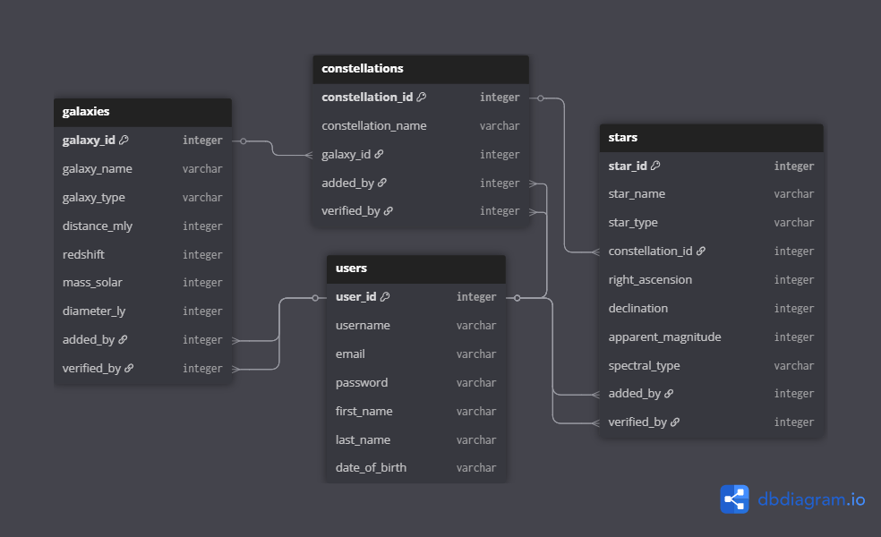
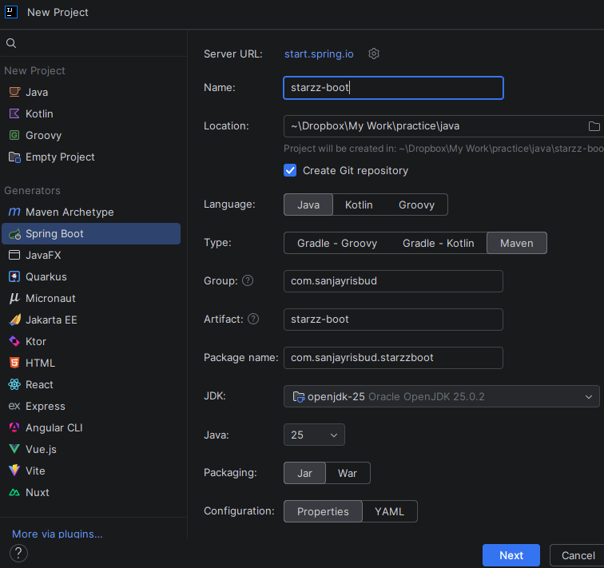
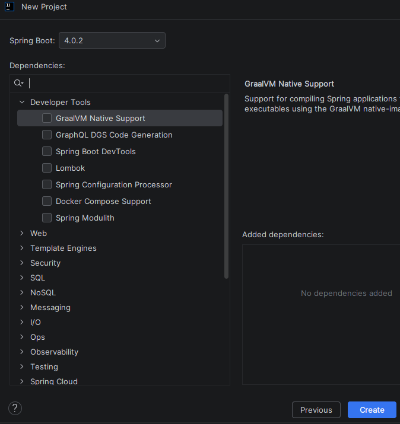
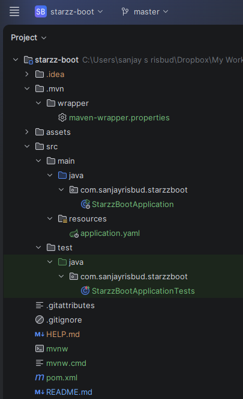

# starzz-boot

This is a REST API backend created using Java's Spring Boot framework.

## The Dataset

This project uses a database of fictional galaxies, constellations and stars.  

Here is a diagram to describe the tables and their relationships:

Stars are located in constellations, which are in turn located in galaxies.

The `galaxies`, `constellations` and `stars` tables contain the additional
fields `added_by` and `verified_by` to indicate the id of the users who made
the finding and verified it, respectively.

The database was created in MySQL.  The scripts to create the tables and
load the dummy data are included in `assets` for reference.  

## The Application

This project was created in IntelliJ IDEA Ultimate.  It uses Java (OpenJDK), Maven and Spring Boot.

First we create a new Spring Boot project.  Instead of manual setup from [https://start.spring.io],
we use IntelliJ:

We don't add any dependencies for now; we will add them as we go along.

After clicking **Create**, IntelliJ generates the starter project files (the project also includes Maven):

All code committed at each chapter is available with the commit message of the chapter name.

### Chapter 1: Setting up the routes

Project dependencies added:

    Spring Web
    Lombok

*A Postman collection for all routes is included in* `assets/starzz-boot.postman_collection.json`

A Spring Boot application follows the MVC pattern for web applications.  So to build our application,
we add the **Spring Web** dependency in `pom.xml`. When we add a dependency in `pom.xml`, Maven
resolves and downloads it automatically from the configured repositories.

    <dependency>
        <groupId>org.springframework.boot</groupId>
        <artifactId>spring-boot-starter-web</artifactId>
    </dependency>

(We remove the version number so Spring Boot can manage versioning for us).

We also add **Lombok** for automatic generation of getters, setters, constructors, etc.:

    <dependency>
        <artifactId>lombok</artifactId>
        <groupId>org.projectlombok</groupId>
        <scope>annotationProcessor</scope>
    </dependency>

(We add the scope because Lombok is only needed during compilation and shouldn't exist at runtime)

One of the auto-generated files in our project is `StarzzBootApplication.java` in package
`com.sanjayrisbud.starzzboot`:

    ... 
    @SpringBootApplication
    public class StarzzBootApplication {
    
        public static void main(String[] args) {
            SpringApplication.run(StarzzBootApplication.class, args);
        }
    
    }

This file defines the class `StarzzBootApplication`, which serves as the entrypoint to our
application.  The `@SpringBootApplication` annotation enables component scanning, which instructs
Spring to discover and register application components as **beans** within the application context.

In Spring, a bean is an object whose lifecycle is managed by the Spring container. Classes
annotated with `@RestController`, `@Service`, or `@Component` are automatically detected
as beans and can be injected where needed.

We now define our application's endpoints.  First we define a class to hold plain responses to
requests to our API endpoints.  In package `com.sanjayrisbud.starzzboot` we add a new package,
`dtos`.  In this package we create a class `Message`:

    @AllArgsConstructor
    @Getter
    @ToString
    public class Message {
        private String text;
    }

(We annotate the class with `@AllArgsConstructor`, `@Getter` and `@ToString` so Lombok will
generate a constructor, getter and toString() method for us.)

When an instance of this class is returned as a response to an HTTP request, Spring Boot takes
care of serializing the instance to JSON.  When an instance of the class is expected as a
parameter to a method, Spring Boot takes care of deserializing the supplied JSON argument to the
needed instance.

We now define classes that would handle HTTP requests to our different API endpoints and 
respond accordingly.  In package `com.sanjayrisbud.starzzboot` we add a new package,
`controllers`.  This package will contain the classes that will handle the requests.

A sample class in the `controllers` package is `ConstellationController`.  We annotate the
class with `@RestController`, which marks the class as a controller where every method returns
a domain object instead of an HTML view.  The `@RequestMapping` annotation specifies the prefix
of the endpoints that the class handles, in this case, `/constellations` endpoints:

    ...
    @RestController
    @RequestMapping("/constellations")
    public class ConstellationController {
        @GetMapping
        public Message getConstellationList() {
            return new Message("Successfully called getConstellationList()");
        }
    
        @GetMapping("/{id}")
        public Message getConstellation(@PathVariable Long id) {
            return new Message("Successfully called getConstellation(" + id + ")");
        }
    
        @PostMapping
        public Message registerConstellation(@RequestBody Message request) {
            return new Message("Successfully called registerConstellation(" + request + ")");
        }
    ...

The mapping annotations (`@GetMapping`, `@PostMapping`, `@PutMapping` and `@DeleteMapping`)
specify the HTTP verb (*GET, POST, PUT* or *DELETE*) that the class method handles.  The
remainder of the handled URL, i.e. after the prefix, is passed as an argument to the annotation.

For the class methods that have parameters, the annotation `@PathVariable` indicates that the
argument is from the mapping annotation's argument (inside the curly braces).  The `@RequestBody`
annotation indicates that the argument is from the body of the request.

The other classes in the `controllers` package follow a similar logic.

So far, our controllers return hardcoded responses. While this is useful to verify that our
routing layer works correctly, real-world applications persist and retrieve data from a database.

In the next chapter, we introduce the persistence layer using Spring Data JPA and connect our
application to a MySQL database.

### Chapter 2: Setting up the database

Project dependencies added:

    Spring Data JPA
    MySQL Driver
    Jakarta Bean Validation

*The Postman collection in* `assets/starzz-boot.postman_collection.json` *has been updated to the
format of requests used in this chapter.*

#### The Persistence Layer

To persist and retrieve data, we now introduce a persistence layer. In Spring Boot applications,
this is typically achieved using Spring Data JPA on top of a relational database.  In our case,
it is our **starzz** database on MySQL.

To allow our application to interact with the database, we would first need to add the
**MySQL driver** to allow our code to execute SQL via JDBC (JDBC is a low-level API
for accessing databases):

        <dependency>
            <groupId>com.mysql</groupId>
            <artifactId>mysql-connector-j</artifactId>
            <scope>runtime</scope>
        </dependency>

(We add the scope because the driver is only needed at runtime and not needed to compile the code)

The MySQL driver enables JDBC connectivity. We also add **Spring Data JPA** to provide
higher-level, object-oriented database interaction.  (We use Spring Data JPA to
interact with the database in an object-oriented way. Hibernate, the default JPA
implementation, handles the actual SQL generation and persistence management.)

        <dependency>
            <groupId>org.springframework.boot</groupId>
            <artifactId>spring-boot-starter-data-jpa</artifactId>
        </dependency>

Since data that we add to the database comes from user input in the requests, we would
need to validate them before modifying the database.  We add **Jakarta Bean Validation** to 
implement request validation:

        <dependency>
            <groupId>org.springframework.boot</groupId>
            <artifactId>spring-boot-starter-validation</artifactId>
        </dependency>

We add the snippets above to `pom.xml`.

With dependencies added, we now configure our data source so Spring Boot can connect to the MySQL
database.  In `application.yaml` we add the application's data source:
    
    datasource:
        url: jdbc:mysql://localhost:3306/starzz
        username: root
        password: root
    jpa:
        show-sql: true

(`username` and `password` are the credentials to our database server, accessible via `url`.
We also set `show-sql` under `jpa` to `true` so the application will log the SQL that
Hibernate generates.)

We now create our code to interact with our database.

Since Spring Data JPA allows us to work with database tables in an object-oriented way, we can
add classes to abstract tables and the operations on them.  In `com.sanjayrisbud.starzzboot`,
we add a new package, `models`, to contain the table abstractions.  An example class is
`Constellation`:

    ...
    @Entity
    @AllArgsConstructor
    @NoArgsConstructor
    @Builder
    @Getter
    @Setter
    @Table(name = "constellations")
    public class Constellation {
        @Id
        @GeneratedValue(strategy = GenerationType.IDENTITY)
        @Column(name = "constellation_id")
        private Integer id;
    
        @Column(name = "constellation_name")
        private String name;
    ...

The `@Entity` annotation specifies that the class is an abstraction of a database table, and
`@Table` specifies the actual table name.  Each instance of this class represents one record
in the table.  `@AllArgsConstructor`, `@NoArgsConstructor`, `@Getter` and `@Setter` are for
Lombok to generate a constructor requiring all fields, a default constructor, getters and setters
for all fields, respectively (these Lombok-generated methods are needed by Spring Data JPA).
`@Builder` (also from Lombok) allows us to create an entity instance using the **Builder**
pattern i.e. one field at a time.  This improves readability by showing which values are
assigned to which fields.

We then have fields with `@Column` corresponding to the table columns.  `@Id` indicates the
primary key and `@GeneratedValue` indicates that the value is generated by the table.

We then define relationships with other entities.  Schema-wise, we have a many-to-one relationship
between `constellations` and `galaxies`; the foreign key is `galaxy_id`  We express that relationship
using:

    ...
    @ManyToOne(fetch = FetchType.LAZY)
    @JoinColumn(name = "galaxy_id")
    private Galaxy galaxy;
    ...

Our entity for the `galaxies` table is `Galaxy`; we define a field `galaxy` to refer to it.  Since
this field uses a foreign key to refer to the parent `Galaxy` we annotate the field with
`@JoinColumn` to specify the foreign key.  `@ManyToOne` specifies the relationship.  For these
types of relationships, the default behavior of Spring Data JPA when it loads a particular entity
into memory is to automatically fetch the related entity.  This is called eager loading.  In our 
case, we indicate `fetch` to override this default and tell Spring Data JPA to fetch the related
entity only when we explicitly ask for it, which is called lazy loading.

In addition, this field has a symmetric field in the entity `Galaxy`:

    @OneToMany(targetEntity = Constellation.class, mappedBy = "galaxy")
    private Set<Constellation> constellations = new HashSet<>();

This field does not correspond to a physical column in the `galaxies` table; it represents the
inverse side of the relationship.  It is a field for the set of its children `Constellation`
objects.  `@OneToMany` specifies  the relationship, `targetEntity` indicates the related entity,
and `mappedBy` indicates the symmetric field.

Two other fields in `Constellation` are defined similarly:

    ...
    @ManyToOne(fetch = FetchType.LAZY)
    @JoinColumn(name = "added_by")
    private User addedBy;

    @ManyToOne(fetch = FetchType.LAZY)
    @JoinColumn(name = "verified_by")
    private User verifiedBy;
    ...

The symmetric fields in the `User` entity corresponding to the table `users`:

    @OneToMany(targetEntity = Constellation.class, mappedBy = "addedBy")
    private Set<Constellation> constellationsAdded = new HashSet<>();

    @OneToMany(targetEntity = Constellation.class, mappedBy = "verifiedBy")
    private Set<Constellation> constellationsVerified = new HashSet<>();

The other classes in the `models` package follow a similar logic.

Now that we have defined our entities as object-oriented representations of database tables,
we introduce the repository layer.  While entities abstract the structure of our tables, 
repositories abstract the operations performed on those entities. They provide a clean interface
for querying, saving, updating, and deleting data without requiring us to write SQL manually.

Our repositories extend the interface `JpaRepository`. Spring Data JPA automatically generates
implementations of these interface at runtime and registers them as beans in the application
context. This allows the repositories to be injected into services or controllers where needed.

In `com.sanjayrisbud.starzzboot`, we add a new package, `repositories`, to contain the repositories.
An example interface is`ConstellationRepository`:

    ...
    public interface ConstellationRepository extends JpaRepository<Constellation, Integer> {
    }

The other interfaces in the `repositories` package follow a similar logic.

#### API Representation Layer

Whenever we send data as part of responses, we usually don't send raw entities from our database.
We create mappings from our entities to custom objects, and send those objects instead.  These
custom objects are known as data transfer objects.  We need to create DTOs for our entities.
In `com.sanjayrisbud.starzzboot.dtos`, we add our DTOs.  An example class is `ConstellationSummaryDto`:

    ...
    public record ConstellationSummaryDto (
        Integer constellationId,
        String constellationName
    ) {}

Since we only need fields for the constellation's id and name, we define this class as a
`record` instead.  This guarantees immutability and clearly signifies its intent as a
data carrier.

Another example is `ConstellationDetailsDto`:

    ...
    @Builder
    @Data
    @JsonPropertyOrder({
        "constellationId",
        "constellationName",
        "galaxy",
        "addedBy",
        "verifiedBy"
    })
    public class ConstellationDetailsDto {
        private Integer constellationId;
        private String constellationName;
        private GalaxySummaryDto galaxy;
        private UserSummaryDto addedBy;
        private UserSummaryDto verifiedBy;
    }

This DTO has additional fields to display the parent galaxy, and the adder and verifier.  These
fields are themselves DTOs.  `@Data` tells Lombok to generate getters and setters for all fields.
Since details DTOs have more fields than summary DTOs, we create objects using `@Builder`.
Although class instances only carry data, we cannot define the class as a `record` because we
build instances one field at a time.

We also have a DTO to accept input when processing requests to add or update constellations:

    @Data
    public class ConstellationDto {
        @NotBlank private String constellationName;
        @NotNull private Integer galaxyId;
        @NotNull private Integer adderId;
        private Integer verifierId;
    }

We add validation annotations to the fields.  `@NotNull` specifies that the field must be present
and cannot be set to `null`.  `@NotBlank` specifies that the field must be present and cannot be
`null`, blank, or an empty string.

The other classes in the `dtos` package follow a similar logic.

We would then need classes to map entities to DTOs.  The **MapStruct** dependency can help
generate mappings for us, but for the purposes of this application we will generate them manually.
In `com.sanjayrisbud.starzzboot`, we add a new package, `mappers`, to contain the classes for
our entity mappers.  An example class is `ConstellationMapper`:

    ...
    @AllArgsConstructor
    @Component
    public class ConstellationMapper {
        private final GalaxyMapper galaxyMapper;
        private final UserMapper userMapper;
    
        public ConstellationSummaryDto toSummaryDto(Constellation constellation) {
            if (constellation == null)
                return null;
    
            return new ConstellationSummaryDto(constellation.getId(), constellation.getName());
        }

        public ConstellationDetailsDto toDetailsDto(Constellation constellation) {
            if (constellation == null)
                return null;
    
            var galaxy = galaxyMapper.toSummaryDto(constellation.getGalaxy());
            var addedBy = userMapper.toSummaryDto(constellation.getAddedBy());
            var verifiedBy = userMapper.toSummaryDto(constellation.getVerifiedBy());
    
            return ConstellationDetailsDto.builder()
                    .constellationId(constellation.getId())
                    .constellationName(constellation.getName())
                    .galaxy(galaxy)
                    .addedBy(addedBy)
                    .verifiedBy(verifiedBy)
                    .build();
        }
    }

`@Component` tags this class as a bean.  In `toSummaryDto()` we create a summary DTO using a regular
constructor.  In `toDetailsDto()` we first get summary DTOs of the related entities, then use the
builder pattern to create the details DTO one field at a time.

The other classes in the `mappers` package follow a similar logic.

Whenever our application processes requests, errors may occur, e.g. a request for a nonexistent
constellation.  Instead of letting the application fail silently, we throw exceptions to convey
information about these events.  We do this with exception handling.  In package
`com.sanjayrisbud.starzzboot.dtos` we add a new class, `ErrorResponseDto`, to contain the
error message:

    ...
    public record ErrorResponseDto(
        String message,
        LocalDateTime timestamp
    ) {}

It has fields for the error message and the error's timestamp.

In `com.sanjayrisbud.starzzboot`, we add a new package, `exceptions`, to contain the classes
for our exception handling.  We create class `ResourceNotFoundException`:

    ...
    @Getter
    public class ResourceNotFoundException extends RuntimeException {
    
        private final String resourceName;
        private final Integer resourceId;
    
        public ResourceNotFoundException(String resourceName, Integer resourceId) {
            super(resourceName + " with id " + resourceId + " not found.");
            this.resourceName = resourceName;
            this.resourceId = resourceId;
        }
    
    }

This will be the custom exception thrown whenever our application searches for nonexistent
resources.

In the same package, we create class `GlobalExceptionHandler`:

    ...
    @RestControllerAdvice
    public class GlobalExceptionHandler {
    
        @ExceptionHandler(ResourceNotFoundException.class)
        public ResponseEntity<ErrorResponseDto> handleNotFound(ResourceNotFoundException ex) {
    
            var errorResponse = new ErrorResponseDto(ex.getMessage(), LocalDateTime.now());
    
            return ResponseEntity.status(HttpStatus.NOT_FOUND).body(errorResponse);
        }
    }
    ...

The `@RestControllerAdvice` annotation makes this class handle all our custom exceptions.
`@ExceptionHanler` specifies the method to handle specific exception classes.  In this case,
`handleNotFound()` is the handler for `ResourceNotFoundException`.  There are also handlers
for validation exceptions thrown by Spring Boot.

We now introduce a service layer to contain our application's business logic.  Introducing a
service layer ensures a clean separation of concerns; controllers can focus solely on HTTP
request handling and not need to worry about the business rules.

In `com.sanjayrisbud.starzzboot`, we add a new package, `services`, to contain the classes for our
service layer.  An example class is `ConstellationService`:

